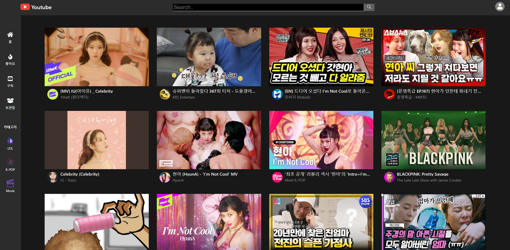
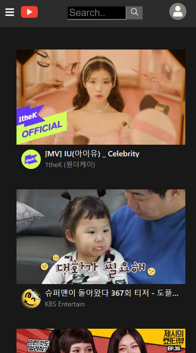
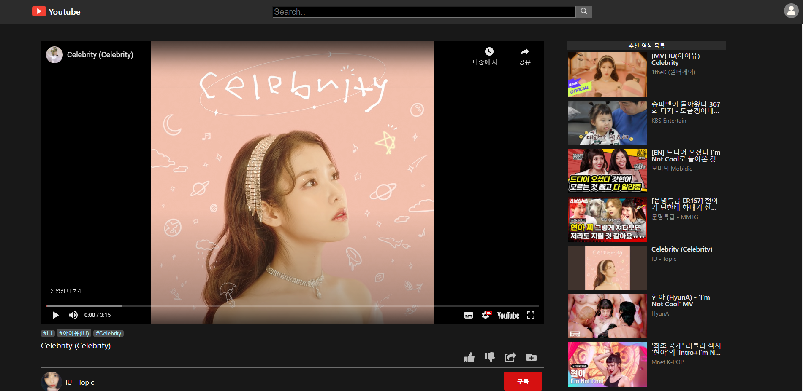
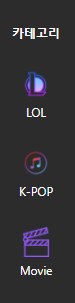
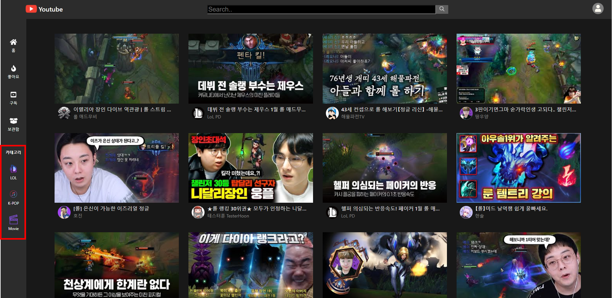
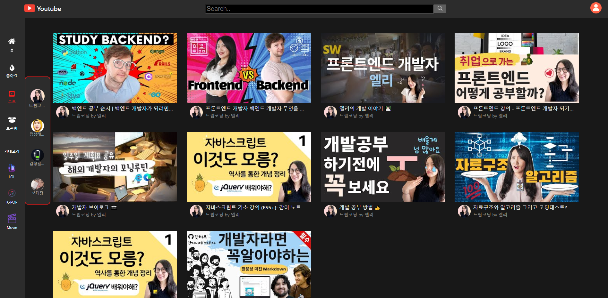
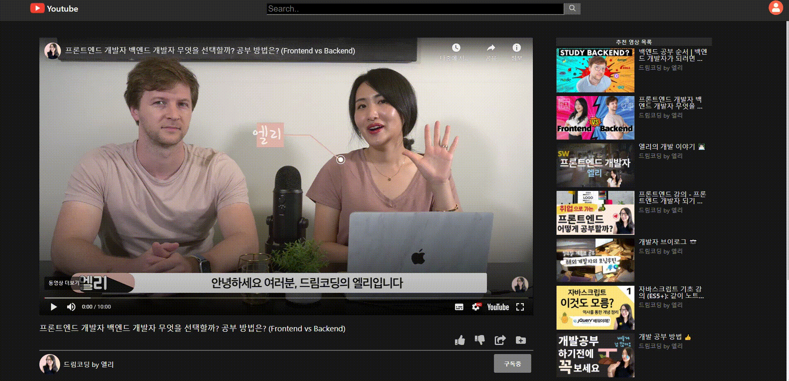

# YouTube Clone 

React practice 

React, PostCSS를 사용해서 YouTube Page를 클론코딩

YouTube Data API, Google OAuth2.0 인증을 통한 기본적인 Video 서비스 제공 및 사용자중심의 Video서비스 제공

[# YouTube Clone URL](https://deokwonpark.github.io/YouTube_Colne/ )


<br/>
<br/>

### 개요

1. [Purpose of the project](#Purpose-of-the-project)
2. [Development stack](#Development-stack )
3. [About The Project](#About-The-Project)
4. [프로젝트를 통해서 어려웠던 점 과 배운점](#프로젝트를-통해서-어려웠던-점-과-배운점)
5. [Reference](#Reference)


<br/>
<br/>


### Purpose of the project

- React에 대한 이해를 높이기 위한 실전 프로젝트
- YouTube Data API사용을 통해 비동기 네트워크 통신에 대한 학습
- Google OAuth2.0인증 방식 학습 


<br/>
<br/>


### Development stack

                                                


<br/>
<br/>


### About The Project

#### 	MAIN Page 

​	`YouTube API를 통해서 Most Popular Videos 정보를 가져와서 보여준다.`

- Desktop

​	        

- Mobile

​    


----


#### 	Video View

- Desktop




- Mobile


----


#### 카테고리 View 기능

`카테고리 분류를 통해서 자주보는 카테고리의 영상을 빠르게 찾아준다.`

          


----


#### Google OAuth 인증을 통해 User의 구독정보를 활용한 기능

- 구독한 채널의 정보를 이용한 영상제공




- 실제 YouTube에 반영되는 구독/구독취소 기능




<br/>
<br/>


### 프로젝트를 통해서 어려웠던 점, 배운점

1. API를 통해 데이터를 받아오는 비동기 함수의 동기화 이슈

   - 다수의 Video에 대한 각각의 채널정보를 받아와서 보여주는 과정에서 기존의 map에서 -> PromiseAll을 사용한 병렬적 처리로 문제를 해결

     **(Before)**

     ```javascript
     fetch("uri", requestOptions)
       .then(response => response.json())
       .then(async (result) => {
         const videos=[];
         await result.items.map((item)=>{
           item = await this.LoadChannelItems(item.snippet.channelId,item);
           videos.push(item);
         });
     
         return new Promise((resolve,reject)=>{
     		resolve(videos);
     	})
       })
       .then((videos)=>this.setState({videos}))
       .catch(error => console.log('error', error));
     ```

      **(After)**

     ```javascript
     fetch("uri", requestOptions)
       .then(response => response.json())
       .then((result) => {
         const videos=[];
         const promises=[];
         result.items.map((item)=>{
           promises.push(this.LoadChannelItems(item.snippet.channelId,item)); 
         });
     
         Promise.all(promises).then((values)=>console.log(values[0].snippet.channels));
       })
       .then((videos)=>this.setState({videos}))
       .catch(error => console.log('error', error));
     ```

   

2. Google OAuth 인증방법과 OAuth의 개념과 동작원리 학습

   - [OAuth2.0 개념 및 동작원리](https://opentutorials.org/course/2473/16571)
   - get access_token

   ```javascript
   oauthSignIn=()=> {
       const oauth2Endpoint = 'https://accounts.google.com/o/oauth2/v2/auth';
     
       const form = document.createElement('form');
       form.setAttribute('method', 'GET');
       form.setAttribute('action', oauth2Endpoint);
       const scope="https://www.googleapis.com/auth/youtube https://www.googleapis.com/auth/youtube.force-ssl https://www.googleapis.com/auth/youtube.readonly https://www.googleapis.com/auth/youtubepartner"
   
       const params = {'client_id': this.API_CLIENT_ID,
                     'redirect_uri': 'https://deokwonpark.github.io/YouTube_Colne/',
                     'response_type': 'token',
                     'scope': scope,
                     'include_granted_scopes': 'true',
                     'state': 'pass-through value'};
     
       for (let p in params) {
         const input = document.createElement('input');
         input.setAttribute('type', 'hidden');
         input.setAttribute('name', p);
         input.setAttribute('value', params[p]);
         form.appendChild(input);
       }
     
       document.body.appendChild(form);
       form.submit();
     }
   ```

   

### Reference

- [드림코딩](https://academy.dream-coding.com/)
- [React](https://reactjs.org/docs/getting-started.html)
- [YouTube Data API](https://developers.google.com/youtube/v3)
- [Google OAuth2.0](https://developers.google.com/identity/protocols/oauth2/javascript-implicit-flow)

